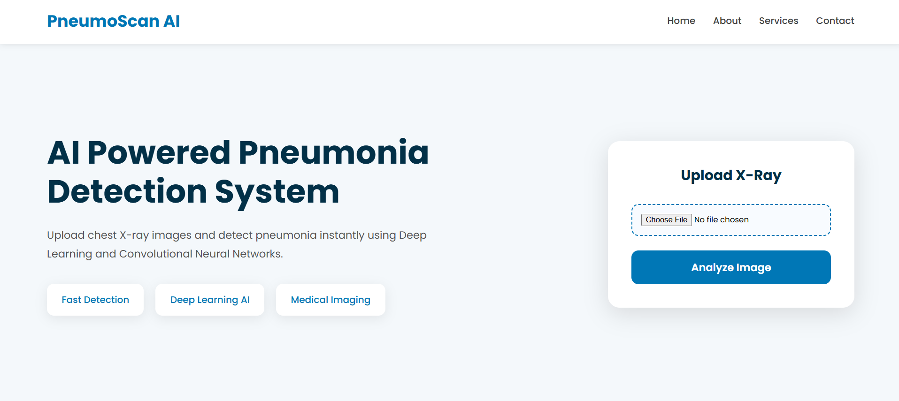
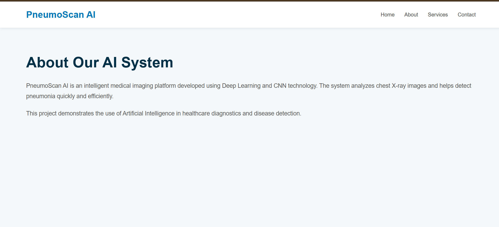
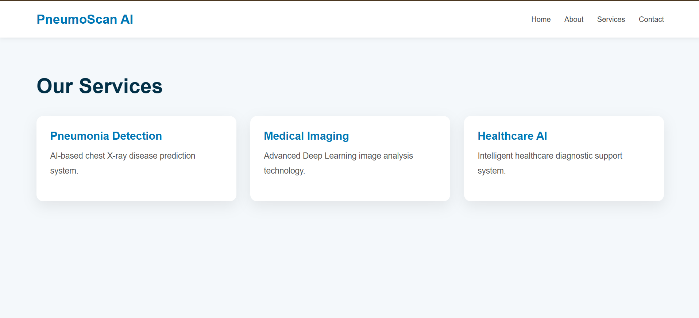
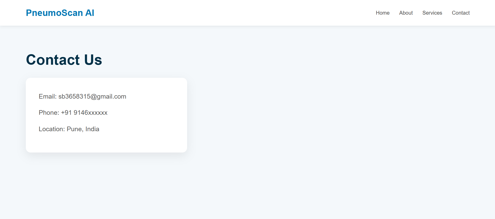
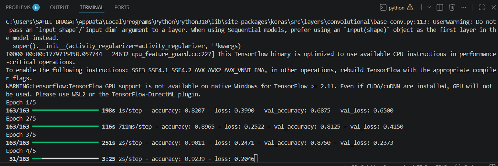
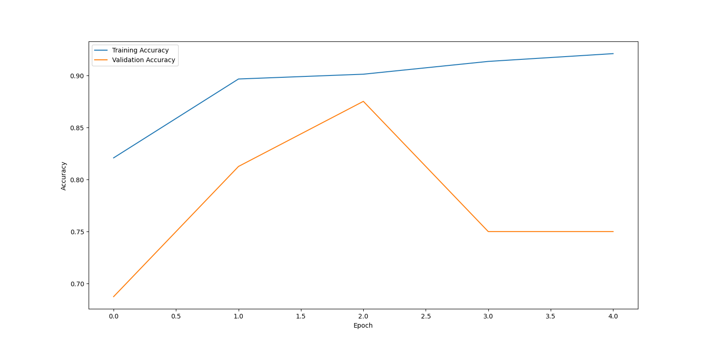
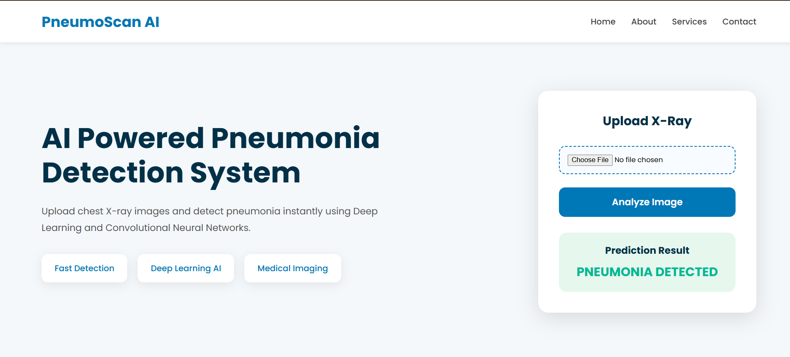

# PneumoScan AI - Pneumonia Detection using CNN

## Overview

PneumoScan AI is a Deep Learning based healthcare web application that detects Pneumonia from Chest X-Ray images using Convolutional Neural Networks (CNN).

The system allows users to upload chest X-ray images and instantly receive predictions through a modern AI-powered medical interface.

---

# Features

- AI Powered Pneumonia Detection
- Chest X-Ray Image Upload
- CNN Deep Learning Model
- Flask Web Application
- Modern Multi-Page Medical UI
- Responsive Design
- Real-Time Prediction
- Professional Healthcare Interface

---

# Technologies Used

- Python
- TensorFlow
- Keras
- Flask
- HTML5
- CSS3
- NumPy
- Matplotlib

---

# Dataset

Chest X-Ray Pneumonia Dataset

Dataset Link:
https://www.kaggle.com/datasets/paultimothymooney/chest-xray-pneumonia

---

# Project Structure

```text
Pneumonia_Detection_Project/
│
├── dataset/
│   ├── train/
│   ├── test/
│   └── val/
│
├── static/
│   └── style.css
│
├── templates/
│   ├── index.html
│   ├── about.html
│   ├── services.html
│   └── contact.html
│
├── uploads/
├── images/
│   ├── home.png
│   ├── about.png
│   ├── services.png
│   ├── contact.png
│   ├── prediction.png
│   ├── training.png
│   └── accuracy.png
│
├── train.py
├── app.py
├── model.h5
├── requirements.txt
└── README.md
```

---

# Installation

## Clone Repository

```bash
git clone YOUR_GITHUB_REPO_LINK
```

## Open Project Folder

```bash
cd Pneumonia_Detection_Project
```

## Install Dependencies

```bash
pip install -r requirements.txt
```

---

# Train Model

Run:

```bash
python train.py
```

After training, the model file:

```text
model.h5
```

will be created automatically.

---

# Run Flask Application

```bash
python app.py
```

Open browser:

```text
http://127.0.0.1:5000
```

---

# Website Pages

## Home Page

- AI Healthcare Landing Page
- Upload Chest X-Ray
- Real-Time Prediction
- Medical Dashboard Interface



---

## About Page

- Information about the AI system
- Deep Learning explanation
- Healthcare AI overview



---

## Services Page

- Pneumonia Detection
- Medical Imaging
- AI Healthcare Services



---

## Contact Page

- Contact Information
- Support Details
- Healthcare Assistance



---

# Model Training

CNN model training process using TensorFlow/Keras.



---

# Accuracy Graph

Training and Validation Accuracy Graph.



---

# Prediction Result

Chest X-Ray image prediction output.



---

# Future Improvements

- Multi-Disease Detection
- Cloud Deployment
- User Authentication
- Report Generation
- Improved CNN Accuracy
- Doctor Dashboard Integration

---

# Author

Lokesh

---

# License

This project is developed for educational and learning purposes.